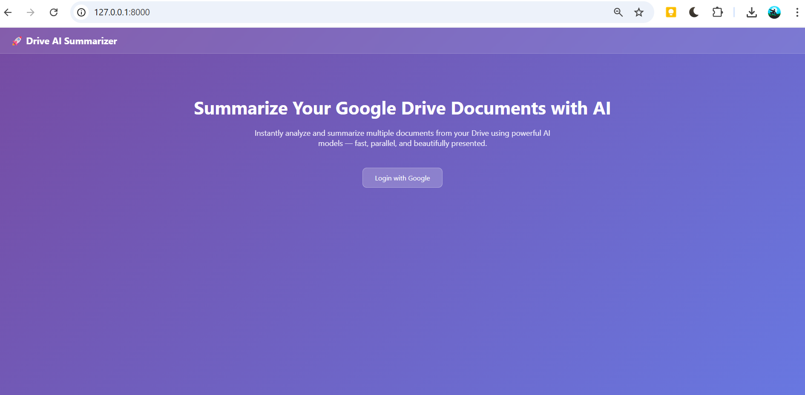
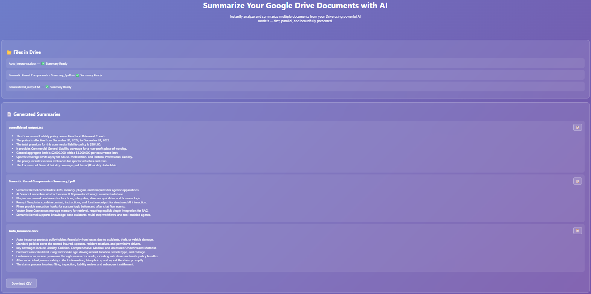

# AI Summarizer - Google Drive File Summarization Tool

A FastAPI-based web application that connects to Google Drive, extracts text from documents (PDF, DOCX, TXT), and generates AI-powered summaries using Google Gemini API. All summaries are compiled into a downloadable CSV report organized by folder structure.

## Features

- **Google Drive Integration**: Authenticate and connect to your Google Drive using OAuth2
- **Multi-Format Support**: Extract text from PDF, DOCX, and TXT files
- **AI-Powered Summarization**: Uses Google Gemini API to generate intelligent summaries
- **Batch Processing**: Concurrent processing of multiple files for faster execution
- **CSV Export**: Download all summaries organized in a structured CSV format with timestamps
- **Web Interface**: User-friendly HTML interface for easy interaction
- **Folder Organization**: Summaries are organized based on Google Drive folder structure

## Live Demo

🔗 **[Live Application Link](https://ai-summarizer-sp5l.onrender.com/)**

## Architecture Diagram


## Screenshots

### Home Page


### Summarize Page


## Generated CSV Files

After you click **"Summarize"**, the application processes all files and generates a CSV report with timestamps.

### CSV File Location
```
output/
├── Summary_FolderName_20260228_143628.csv
├── Summary_FolderName_20260228_150245.csv
└── ... (more CSV files with different timestamps)
```

### Accessing Your CSV Files

**Option 1: Download from Web Interface**
1. Click the "Summarize" button
2. Once processing completes, click the "Download" button
3. CSV file will download with format: `Summary_FolderName_YYYYMMDD_HHMMSS.csv`

**Option 2: Open from File System**
1. Navigate to the `output/` folder in your project directory
2. Find your CSV file by timestamp
3. Open with Excel, Google Sheets, or any text editor

### CSV File Format
```
file,summary
Auto_Insurance.docx,"This document provides an overview of auto insurance..."
Semantic_Kernel_Components.pdf,"The PDF explains the key components..."
consolidated_output.txt,"This text file contains consolidated information..."
```

### Data Flow Sequence

```
1. User Visits App
   └─> HOME (/): Display login button (index.html)

2. User Clicks Login
   └─> GET /login
       └─> Generate OAuth2 Authorization URL
           └─> Redirect to Google signin page

3. Google Redirects Back
   └─> GET /auth/callback?code=...&state=...
       └─> Exchange auth code for credentials
           └─> Store credentials in session
               └─> Redirect to /process

4. Process Page Loads
   └─> GET /process
       └─> Retrieve stored credentials
           └─> List all files from Google Drive Folder
               └─> Get folder name from Drive
                   └─> Display files in UI

5. User Clicks Summarize
   └─> GET /summarize
       └─> Retrieve credentials
           └─> List files from Google Drive

               ┌─────── FOR EACH FILE ──────┐
               │                            │
               ├─> Download file from Drive │
               │                            │
               ├─> Extract text             │
               │   - pdfplumber (PDF)       │
               │   - python-docx (DOCX)     │
               │   - plain read (TXT)       │
               │                            │
               ├─> Send to Gemini API       │
               │   for summarization        │
               │                            │
               └─> Collect summary result ──┘

               └─> Generate CSV Report
                   └─> Return summaries to UI
                       └─> User downloads CSV

6. Download Report
   └─> CSV file with format:
       filename,summary
       Document1.pdf,"Summary..."
       Document2.docx,"Summary..."
```

### System Architecture

```
┌────────────────────────────────────────────────────────────┐
│                     STORAGE LAYER                          │
│                                                            │
│  ┌──────────────┐  ┌──────────────┐  ┌──────────────┐      │
│  │   temp/      │  │   output/    │  │   .env       │      │
│  │ (Downloaded  │  │ (CSV Reports)│  │ (Config)     │      │
│  │  files)      │  │ (Timestamps) │  │              │      │
│  └──────────────┘  └──────────────┘  └──────────────┘      │
└────────────────────────────────────────────────────────────┘
                          ▲
                          │
┌────────────────────────────────────────────────────────────┐
│              PROCESSING & TRANSFORMATION                   │
│                                                            │
│  Concurrent Processing (ThreadPoolExecutor)                │
│  ├─> Max 3 workers for parallel file processing            │
│  ├─> Each worker: Download → Extract → Summarize           │
│  └─> Aggregate results into single CSV                     │
└────────────────────────────────────────────────────────────┘
                          ▲
                          │
┌────────────────────────────────────────────────────────────┐
│              CORE APPLICATION SERVICES                     │
│                                                            │
│  ┌──────────────────────────────────────────────┐          │
│  │          Summarizer Service                  │          │
│  │   • Calls Google Gemini API                  │          │
│  │   • Generates AI summaries                   │          │
│  │   • Handles errors gracefully                │          │
│  └──────────────────────────────────────────────┘          │
│                     ▲                                      │
│  ┌──────────────────┴───────────────────────────┐          │
│  │                                              │          │
│  ▼                                              ▼          │
│ ┌──────────────────┐      ┌──────────────────┐             │
│ │ Parser Service   │      │ Report Service   │             │
│ │ • Extract text   │      │ • Generate CSV   │             │
│ │ • Handle formats │      │ • Format output  │             │
│ └──────────────────┘      └──────────────────┘             │
│  ▲                                              ▲          │
│  └──────────────────┬───────────────────────────┘          │
│                     │                                      │
│  ┌──────────────────▼───────────────────────────┐          │
│  │          Drive Service                       │          │
│  │   • OAuth2 authentication                    │          │
│  │   • List files from Drive                    │          │
│  │   • Download documents                       │          │
│  │   • Get folder metadata                      │          │
│  └──────────────────────────────────────────────┘          │
│                                                            │
│  ┌──────────────────────────────────────────────┐          │
│  │          Config Service                      │          │
│  │   • Load environment variables                │         │
│  │   • Manage API keys securely                 │          │
│  └──────────────────────────────────────────────┘          │
└────────────────────────────────────────────────────────────┘
```

## Project Structure

```
ai-summarizer/
├── app/
│   ├── core/
│   │   └── config.py              # Configuration and environment variables
│   ├── services/
│   │   ├── drive_service.py       # Google Drive API integration
│   │   ├── parser_service.py      # Text extraction from documents
│   │   ├── summarizer_service.py  # AI summarization logic
│   │   └── report_service.py      # CSV report generation
│   ├── templates/
│   │   └── index.html             # Web interface
│   └── main.py                    # FastAPI application and routes
├── temp/                          # Temporary file storage during processing
├── output/                        # Generated CSV reports output
├── .env                           # Environment variables (not included in repo)
├── .gitignore                     # Git ignore rules
├── credentials.json               # Google OAuth credentials (not included in repo)
├── pyproject.toml                 # Project configuration for uv
├── requirements.txt               # Project dependencies for pip
├── uv.lock                        # Lock file for uv
└── README.md                      # This file
```

## Prerequisites

- Python 3.12 or higher
- Google Account with Drive API enabled
- Google Gemini API key
- A Google Drive folder ID containing the documents to summarize

## Setup Instructions

### Option 1: Using UV Package Manager (Recommended)

UV is a faster, modern Python package manager written in Rust. Follow these steps:

1. **Install UV** (if not already installed):
   ```bash
   curl https://astral.sh/uv/install.sh | sh
   # or on Windows:
   powershell -ExecutionPolicy BypassUser -c "irm https://astral.sh/uv/install.ps1 | iex"
   ```

2. **Clone or navigate to the project directory**:
   ```bash
   cd ai-summarizer
   ```

3. **Create a virtual environment and install dependencies**:
   ```bash
   uv sync
   ```

4. **Activate the virtual environment**:
   ```bash
   # On Linux/macOS:
   source .venv/bin/activate

   # On Windows:
   .venv\Scripts\activate
   ```

### Option 2: Using Pip

1. **Create a virtual environment**:
   ```bash
   python -m venv .venv
   ```

2. **Activate the virtual environment**:
   ```bash
   # On Linux/macOS:
   source .venv/bin/activate

   # On Windows:
   .venv\Scripts\activate
   ```

3. **Install dependencies**:
   ```bash
   pip install -r requirements.txt
   ```

## Configuration

### Step 1: Set Up Google OAuth Credentials

1. Go to [Google Cloud Console](https://console.cloud.google.com/)
2. Create a new project
3. Enable the Google Drive API
4. Create OAuth 2.0 credentials (Desktop application)
5. Download the credentials as JSON and save as `credentials.json` in the project root

### Step 2: Create Environment Variables

Create a `.env` file in the project root with the following variables:

```
GEMINI_API_KEY=your_gemini_api_key_here
GOOGLE_FOLDER_ID=your_google_drive_folder_id_here
```

**How to get these values:**

- **GEMINI_API_KEY**:
  - Visit [Google AI Studio](https://aistudio.google.com/app/apikey)
  - Create a new API key for the Gemini API
  - Copy and paste it in the `.env` file

- **GOOGLE_FOLDER_ID**:
  - Open your Google Drive folder in a browser
  - The URL will be: `https://drive.google.com/drive/folders/FOLDER_ID_HERE`
  - Copy the folder ID and paste it in the `.env` file

## Running the Application

1. **Start the FastAPI server**:
   ```bash
   uvicorn app.main:app --reload
   ```

2. **Open your browser** and navigate to:
   ```
   http://localhost:8000
   ```

3. **Authenticate** with your Google account by clicking the login button

4. **Process documents**:
   - View the list of files in your Google Drive folder
   - Click "Summarize" to start processing
   - The application will extract text, generate summaries, and compile a CSV report

5. **Download results**:
   - Once processing is complete, download the CSV file containing all summaries
   - The CSV file will be named: `Summary_[FolderName]_[Timestamp].csv`

## Dependencies

### Core Dependencies
- **FastAPI**: Modern web framework for building APIs
- **Uvicorn**: ASGI server for running FastAPI
- **Jinja2**: Template engine for HTML rendering
- **Python-Multipart**: Support for file uploads and form data

### Google Integration
- **google-api-python-client**: Google Drive API client
- **google-auth**: Authentication for Google APIs
- **google-auth-oauthlib**: OAuth2 authentication for Google
- **google-genai**: Google Gemini API client

### Document Processing
- **pdfplumber**: Extract text from PDF files
- **PyMuPDF**: Additional PDF processing capabilities
- **python-docx**: Extract text from DOCX files

### Data & Utilities
- **Pandas**: Data manipulation and CSV generation
- **python-dotenv**: Load environment variables from `.env`

## Output Format

The generated CSV file contains the following columns:
- **file**: Name of the original document
- **summary**: AI-generated summary of the document content

Example output:
```
file,summary
Document1.pdf,"Summary of document 1 content..."
Document2.docx,"Summary of document 2 content..."
Document3.txt,"Summary of document 3 content..."
```

## How It Works

1. **Authentication**: User logs in with Google account using OAuth2
2. **File Discovery**: Application lists all files in the specified Google Drive folder
3. **Download & Extract**: Each document is downloaded and text is extracted
4. **Summarization**: Extracted text is sent to Google Gemini API for summarization
5. **Report Generation**: All summaries are compiled into a CSV file with timestamp
6. **Download**: User can download the final CSV report

## Troubleshooting

### Authentication Issues
- Ensure `credentials.json` is in the project root
- Check that the OAuth app is set to "Desktop application"
- Verify the redirect URI matches your setup (typically `http://localhost:8000/auth/callback`)

### API Key Issues
- Verify `GEMINI_API_KEY` is correctly set in `.env`
- Ensure the API key has access to the Gemini API
- Check that the project has billing enabled for Google Cloud

### File Processing Issues
- Only PDF, DOCX, and TXT files are processed
- Ensure files have readable text content
- Check file permissions in Google Drive (must be readable by the authenticated user)

### Folder ID Issues
- Verify the folder ID is correct (copy directly from the Drive URL)
- Ensure the folder is shared with or owned by the authenticated account

## Development

### Project Stack
- **Framework**: FastAPI (Python web framework)
- **Package Manager**: UV (primary) / Pip (alternative)
- **Python Version**: 3.12+
- **AI Model**: Google Gemini API

### To Modify Configuration
Edit `app/core/config.py` to add or modify settings.

### To Add New Document Types
Update `process_single_file()` in `app/main.py` to support additional file extensions.

## License

Open source project - feel free to use and modify as needed.

## Support

For issues or questions:
1. Check the Troubleshooting section above
2. Review the Google Cloud Console logs
3. Verify all API credentials are correctly configured

---

**Last Updated**: February 27, 2026
